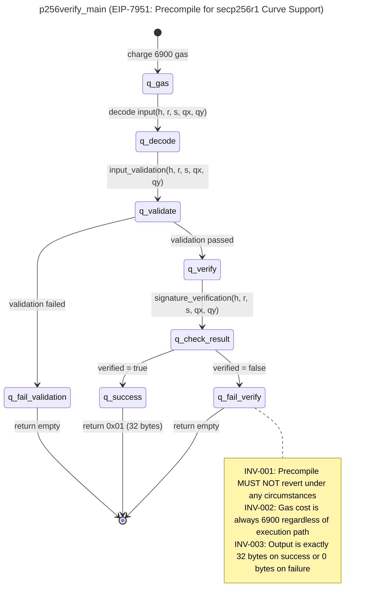

# SPECA 詳細解説（日本語版） — 第 3 章 パイプライン詳細（フェーズ 01a〜04）

> 関連：[概略と目次](概略と目次.md) ／ [前：第 2 章 リポジトリ構成](SPECA詳細解説日本語版_第2章.md) ／ [次：第 4 章 マニュアルフェーズ](SPECA詳細解説日本語版_第4章.md)

本章では SPECA の自動 6 フェーズ（`01a` → `01b` → `01e` → `02c` → `03` → `04`）の動作を 1 つずつ解説します。マニュアル実行のフェーズ 05／06／06b は次章で扱います。

各節の構成は次のとおりです：

- **目的** — このフェーズが何を達成するか
- **入出力** — 入力ファイル／出力ファイル
- **内部処理** — どのようなロジックで処理しているか
- **設計判断** — なぜそうなっているか／注意点

---

## 3.1 フェーズ 01a：仕様文書の発見（Specification Discovery）

| 項目 | 内容 |
|---|---|
| **プロンプト** | `prompts/01a_crawl.md` |
| **スキル** | `/spec-discovery` |
| **入力** | シード URL（環境変数 `SPEC_URLS`） |
| **出力** | `outputs/01a_STATE.json` |
| **MCP** | `fetch` |
| **モデル** | Opus（既定） |

### 目的

ユーザが渡したシード URL から **再帰的にリンクを辿り**、関連する仕様文書（EIP、コンセンサス仕様、execution 仕様等）の **カタログを作る**。

### 内部処理

`/spec-discovery` スキルが MCP の `fetch` ツールでページを取得し、リンクを再帰的に辿って仕様文書らしきページを抽出します。各エントリには URL、タイトル、カテゴリ（EIP／consensus-specs／execution-specs／…）、レイヤ（execution／consensus／networking）、説明が付与されます。

### 出力例（Ethereum Fusaka コンテストでの実行例から抜粋）

```json
{
  "start_url": "https://github.com/ethereum/EIPs/blob/master/EIPS/eip-7594.md",
  "found_specs": [
    {
      "url": "https://github.com/ethereum/EIPs/blob/master/EIPS/eip-7594.md",
      "title": "EIP-7594: PeerDAS - Peer Data Availability Sampling",
      "category": "EIP",
      "type": "Standards Track / Core",
      "status": "Final",
      "layer": "consensus+networking"
    },
    { "url": "...", "title": "EIP-7823: Set Upper Bounds for MODEXP", ... }
  ],
  "metadata": {
    "timestamp": "2026-02-05T12:00:00Z",
    "total_specs": 28,
    "breakdown": { "eips": 11, "consensus_specs": 7, "execution_specs": 9 }
  }
}
```

### 設計判断

- **クロール深さは固定でなく LLM 判断**：`fetch` で本文を取得し、リンクの「仕様らしさ」をプロンプトベースで判定するため、URL パターンに依存しません
- **後段で重要なのは「タイトル」と「カテゴリ」**：これがフェーズ 01b でサブグラフを抽出する単位になります

---

## 3.2 フェーズ 01b：サブグラフ抽出（Subgraph Extraction）

| 項目 | 内容 |
|---|---|
| **プロンプト** | `prompts/01b_extract_worker.md` |
| **スキル** | `/subgraph-extractor` |
| **入力** | `outputs/01a_STATE.json` |
| **出力** | `outputs/01b_PARTIAL_*.json` ＋ `outputs/graphs/*/*.mmd` |
| **MCP** | `fetch`, `filesystem` |
| **モデル** | Opus（既定） |

### 目的

仕様文書 1 つ 1 つを、Nielson & Nielson のプログラムグラフ定義に従って **手続き単位のグラフ** に分解する。

> プログラムグラフ：`PG = (Q, q▷, q◀, Act, E)`
> - **Q**：ノード（プログラムポイント）の有限集合
> - **q▷, q◀**：初期ノードと終了ノード
> - **Act**：アクション（代入・テスト・ガード）の集合
> - **E ⊆ Q × Act × Q**：辺の有限集合
> （出典：Nielson & Nielson, *Formal Methods: An Appetizer*, Springer 2019）

### 内部処理

各仕様文書に対して `/subgraph-extractor` スキルが呼ばれ、文書に登場する **手続き** を識別し、それぞれをプログラムグラフに変換して **拡張版 Mermaid 状態遷移図**（`.mmd`）として出力します。

`.mmd` ファイルは：

- **YAML フロントマター** にタイトル・参照仕様・サブグラフ ID を記録
- **状態遷移本体** を `stateDiagram-v2` 形式で記述
- **`note right of`** ブロックで RFC 2119（MUST／SHOULD／MAY）由来の **不変条件**（`INV-001`、`INV-002`、…）を埋め込み

### 出力例 — `.mmd` ファイル



> **図の補足説明（Mermaid のレンダリング環境がない場合に備えて）：**
> 上図は EIP-7951（secp256r1 precompile）のメイン手続き `p256verify_main` のプログラムグラフ。実行は `[*]` から始まり、6900 ガスを消費 → 入力デコード → 入力検証 → 検証成功なら署名検証 → 結果に応じて `0x01`（32 バイト）または空を返す。各終端には RFC 2119 に基づく 3 つの不変条件（INV-001 リバート禁止、INV-002 ガスコスト一定、INV-003 出力長一定）が `note right of` ブロックで付与されている。これらの INV ラベルは後段でプロパティの来歴（プロブナンス）として使われる。

### 出力例 — PARTIAL JSON

PARTIAL JSON は `.mmd` ファイルへのポインタを含む軽量な索引です：

```json
{
  "specs": [
    {
      "source_url": "https://github.com/ethereum/EIPs/blob/master/EIPS/eip-7951.md",
      "title": "EIP-7951: Precompile for secp256r1 Curve Support",
      "sub_graphs": [
        { "id": "SG-001", "name": "p256verify_main",
          "mermaid_file": "outputs/graphs/W0B1_1770278556/EIP-7951/SG-001_p256verify_main.mmd" },
        { "id": "SG-002", "name": "input_validation",
          "mermaid_file": "..." }
      ]
    }
  ],
  "metadata": { "phase": "01b", "worker_id": 0, "batch_index": 1, ... }
}
```

### 設計判断

- **Mermaid を採用した理由**：人間にも LLM にも読めるテキスト形式で、`.mmd` 単体でレンダリング可能。グラフ構造をコメントなしに表現できる
- **YAML フロントマター＋note ブロック** で、グラフ本体（構造）と仕様要件（INV-* ラベル）を分離。後段で「INV-* がどこから来たか」を辿れる
- **ファイル参照型 PARTIAL**：JSON 本体は索引だけを持ち、グラフ本体は `.mmd` 別ファイル。JSON が膨らまず、Mermaid をそのまま Web で閲覧できる利点

---

## 3.3 フェーズ 01e：プロパティ生成（Property Generation）

| 項目 | 内容 |
|---|---|
| **プロンプト** | `prompts/01e_prop_worker.md`（**インライン化**：スキルフォーク無し） |
| **入力** | `outputs/01b_PARTIAL_*.json` ＋ **`outputs/BUG_BOUNTY_SCOPE.json`（必須）** |
| **出力** | `outputs/01e_PARTIAL_*.json` |
| **MCP** | （なし） |
| **モデル** | Opus（既定） |

### 目的

サブグラフを **入力**、`BUG_BOUNTY_SCOPE.json` の信頼モデルを **コンテキスト** として、各サブグラフから **型付きセキュリティプロパティ** を生成する。

### 内部処理

ワーカは「Formal Methods Specialist + Security Architect + Bug Bounty Triager」のマインドセットで動作し、2 つのフェーズを順に実行します：

#### サブフェーズ A：信頼モデル分析（Trust Model Analysis）

サブグラフの記述・ノード種別・関数名・辺アクションから、システムと相互作用する **アクター** を全て列挙：

- ネットワークピア、API クライアント、内部コンポーネント、管理者、外部サービス、データベース、ファイルシステム、…

そのうえで **信頼境界** を識別。境界とは「異なる信頼レベルのアクター間でデータ／制御が渡る場所」のこと。

> **重要**：このサブフェーズはサブグラフと `BUG_BOUNTY_SCOPE.json` のみを材料にし、**コードベースは一切探索しません**。仕様レベルの信頼モデルを純粋に作る段階です。

#### サブフェーズ B：プロパティ生成（Property Generation）

ドメイン非依存の **STRIDE** 思考フレームワーク（Spoofing／Tampering／Repudiation／Information Disclosure／Denial of Service／Elevation of Privilege）を、CWE Top 25 のパターン（CWE-22／78／89／94／200／502／639／770／862）で補強しながら、各サブグラフから次の 4 種のプロパティを生成：

| 種別 | 意味 |
|---|---|
| `invariant` | 任意のタイミングで成り立つべき不変条件 |
| `pre-condition` | 特定の遷移／関数呼び出しの **前** に成り立つべき条件 |
| `post-condition` | 特定の遷移／関数呼び出しの **後** に成り立つべき条件 |
| `assumption` | 環境やアクターに対する仮定 |

### 出力例

```json
{
  "properties": [
    {
      "property_id": "PROP-56ad1eb2-inv-001",
      "text": "P256VERIFY must accept valid secp256r1 signatures and reject all invalid ones deterministically.",
      "type": "invariant",
      "assertion": "forall (h,r,s,qx,qy): p256verify(h,r,s,qx,qy) == true iff ECDSA_verify(h,r,s,(qx,qy)) == true",
      "severity": "CRITICAL",
      "covers": "SG-003",
      "reachability": {
        "classification": "external-reachable",
        "entry_points": ["Transaction", "P2P"],
        "attacker_controlled": true,
        "bug_bounty_scope": "in-scope"
      },
      "bug_bounty_eligible": true,
      "exploitability": "external-attack"
    }
  ],
  "metadata": {
    "total_properties": 45,
    "by_severity": { "CRITICAL": 9, "HIGH": 18, "MEDIUM": 16, "INFORMATIONAL": 2 },
    "by_scope": { "in_scope": 35, "out_of_scope": 10 },
    "bug_bounty_eligible_count": 30
  }
}
```

### スリム出力スキーマ

第 1 章で「フェーズ 01e にはスキーマの最適化がある」と書きましたが、その実体は次の 2 点です：

- **`covers`** は文字列 1 つ（プライマリのサブグラフ ID。例：`"SG-003"`）。配列ではない
- **`reachability`** は 4 フィールドのみ（`classification` ／ `entry_points` ／ `attacker_controlled` ／ `bug_bounty_scope`）

このスリム化は、後段（02c／03／04）に渡るコンテキスト量を抑え、Sonnet のコンテキストウィンドウ上で 1 件 1 バッチ処理を可能にするための重要な最適化です。

### 設計判断

- **スキルフォークではなくインラインプロンプト**：信頼モデル分析と STRIDE 推論を 1 つのワーカ内で連続実行することで、コンテキストフォーク（スキル呼び出しごとに別コンテキストを開く）のオーバーヘッドを削減
- **`BUG_BOUNTY_SCOPE.json` 必須・無ければ `sys.exit(1)`**：信頼モデルとセベリティ判定はターゲット固有の情報であり、ハードコードされた既定値で代用してはいけない、という強い設計判断
- **ドメイン非依存**：Ethereum 専用ハードコードは無く、STRIDE＋CWE Top 25 のみで動作。新規ターゲットへ流用可能

---

## 3.4 フェーズ 02c：コード位置の事前解決（Code Pre-resolution）

| 項目 | 内容 |
|---|---|
| **プロンプト** | `prompts/02c_codelocation_worker.md`（インライン化） |
| **入力** | `outputs/01e_PARTIAL_*.json` ＋ `outputs/TARGET_INFO.json` ＋ `outputs/01b_SUBGRAPH_INDEX.json` |
| **出力** | `outputs/02c_PARTIAL_*.json` |
| **MCP** | `tree_sitter`, `filesystem` |
| **モデル** | **Sonnet** |
| **重要度ゲート** | `Informational` を除外（既定 `min_severity="Low"`） |

### 目的

各プロパティが、対象実装のどのファイル・どの関数・どの行範囲で実装されているかを **先に特定** する。フェーズ 03 でのトークン消費を 40〜60% 削減する目的の最適化フェーズ。

### 内部処理

ワーカは次の段階で動きます：

1. **リポジトリオリエンテーション**（バッチごとに 1 回）：`target_workspace/*/` を Glob してトップレベルディレクトリの一覧を取得し、「どのパッケージがどのドメイン（crypto／networking／state／consensus／…）を扱っているか」のメンタルマップを作る
2. **レイヤスコープチェック**：プロパティが対象リポジトリの責任範囲外（例：`out_of_scope_spec_layers=["execution"]` のとき execution 層プロパティ）なら早期に `out_of_scope` 判定
3. **検索語の導出**：仕様の `snake_case` を Go なら `PascalCase` に変換するなど、ターゲット言語に合わせた識別子を作成
4. **多段検索**：
   - **段階 a**：最も具体的な識別子で `Grep`／`Tree-sitter get_symbols`
   - **段階 b**：段階 a が失敗したら、語幹・略称・関連定数で再試行（最低 3 試行）
   - **段階 c**：意味的フォールバック — 仕様の定数値・magic number、コメント文字列で検索
5. **実装レベル関連物の解決**：プライマリ位置を見つけたら、その**呼出元・キャッシュ構造・dedup ラッパ**を grep で探し、`role: "related"` として記録

### 重要：「キャッシュキーバグ」の発見メカニズム

工程 5 が **Sherlock コンテストで Prysm の inclusion proof cache poisoning（#190）を見つけられた直接の理由** です。

仕様レベルでは見えない「キャッシュキーが入力の一部しか含んでいない」というバグは、プライマリ関数とそのキャッシュ／dedup ラッパが **同時に Phase 03 のコンテキストに入って初めて見える**。02c がこれを事前に紐付けます。

### 出力例

```json
{
  "properties_with_code": [
    {
      "property_id": "PROP-56ad1eb2-inv-001",
      "text": "P256VERIFY must ...",
      "code_scope": {
        "locations": [
          {
            "file": "core/vm/contracts.go",
            "symbol": "p256Verify.Run",
            "line_range": { "start": 1433, "end": 1449 },
            "role": "primary"
          },
          {
            "file": "crypto/secp256r1/verifier.go",
            "symbol": "Verify",
            "line_range": { "start": 27, "end": 27 },
            "role": "callee"
          }
        ],
        "resolution_status": "resolved",
        "resolution_method": "grep_fallback"
      }
    }
  ]
}
```

`resolution_status` は 4 値：

- `resolved`：場所が見つかった
- `not_found`：3 試行しても見つからなかった
- `specification_only`：仕様の中にしか登場しない（実装する必要がないか、まだ実装されていない）
- `out_of_scope`：レイヤスコープ違反

### 設計判断

- **「コード片を抜粋しない」**：行範囲（line_range）だけ記録し、実コードは持ち回さない。トークン削減のため
- **Tree-sitter MCP の優先利用**：シンボル解決は `mcp__tree_sitter__get_symbols` で。grep フォールバックは並行する
- **3 試行ルール**：最低 3 つ別の検索語で試してから `not_found` にする。早すぎる諦めを防ぐ
- **`01b_SUBGRAPH_INDEX.json` の活用**：02c はバッチ起動時に 01b PARTIAL から索引を作り、プロパティの `text`／`assertion` のキーワードで仕様レベルの関数名／状態遷移／不変条件を引いてから検索語を組む

---

## 3.5 フェーズ 03：監査マップ生成（Audit Map / Formal Audit）

| 項目 | 内容 |
|---|---|
| **プロンプト** | `prompts/03_auditmap_worker_inline.md`（インライン化） |
| **入力** | `outputs/02c_PARTIAL_*.json` ＋ 対象コードベース（`TARGET_INFO.json` から自動 clone） |
| **出力** | `outputs/03_PARTIAL_*.json` |
| **MCP** | （なし）／ ツールフィルタ：`Read, Write, Grep, Glob` のみ |
| **モデル** | Sonnet |
| **バッチサイズ** | 1（プロパティ間の文脈混入を避けるため） |
| **予算上限** | `max_budget_usd=200.0`（最高コストフェーズ） |
| **ターン上限** | `max_turns_per_batch=50`（中央値 ≈19、複雑プロパティは 25〜30） |

### 目的

各プロパティに対し **「成り立つことを証明しようとする」** 推論を実行し、証明が破綻する箇所を所見として報告する。SPECA の中核フェーズ。

### 3 サブフェーズの内部処理

#### サブフェーズ 1：Map（プロパティをコードに紐付ける）

1. **assertion を分解**：プロパティの主張を検証可能な部分主張に分解（例：「キャッシュキーがすべての入力を含む」→ どの入力？どのキャッシュ？どのキー構築関数？）
2. **コードを完全に読む**：プライマリ関数の **全体**（フラグされた行だけでなく）、最低 1 段の呼出元と呼出先まで読む
3. **強制機構の列挙**：プロパティを支えているコード要素（ガード／ロック／型制約／境界チェック／信頼境界／仕様疑似コードに従ったコメント）を全て列挙
4. **理解を文章化**：「プロパティ X は機構 M1（file:line）、M2（file:line）、… で強制されている」と明文化してから次へ進む

#### サブフェーズ 2：Prove（証明を試みる）

各部分主張に対して 5 軸で検証：

| 軸 | 何を検査するか |
|---|---|
| **入力カバレッジ** | すべての入力経路（API／RPC／P2P／DB／ファイル）でプロパティが満たされるか |
| **パスカバレッジ** | 全ての制御フロー上で満たされるか（早期 return／panic／例外で抜ける経路を含む） |
| **並行性安全** | ロックの粒度・順序・データ競合 |
| **時間的妥当性** | リオルグ／フォーク／タイマーリセット時の挙動 |
| **実装パターン上の義務** | 例：キャッシュキーや dedup キーが「完全な入力」から計算されているか |

**証明できなかった箇所はギャップとして記録され、それが所見になります。**

#### サブフェーズ 3：Stress-Test（結論への挑戦）

- 証明が **成功** したなら：すべての仮定を再検査して反例を作ろうとする
- 証明が **失敗** したなら：具体的な攻撃パスを構築できるかを試す
- 攻撃パスを作れない所見は `vulnerability` から `potential-vulnerability` に **格下げ**

### 出力スキーマ（コンパクト 6 フィールド）

```json
{
  "audit_items": [
    {
      "property_id": "PROP-6a4369e9-inv-042",
      "classification": "vulnerability",
      "code_path": "beacon-chain/verification/data_column.go::inclusionProofKey::L527-547",
      "proof_trace": "The cache key omits KzgCommitments (the data being proven), including only the inclusion proof and header hash. Two data columns with identical proofs/headers but different commitments produce the same cache key, ...",
      "attack_scenario": "Attacker sends valid DataColumnSidecar A, then sends forged DataColumnSidecar M with same inclusion proof and header but malicious KzgCommitments. Cache lookup succeeds on M's key, bypassing full Merkle verification ...",
      "checklist_id": "PROP-6a4369e9-inv-042"
    }
  ]
}
```

`classification` の値域：

- `vulnerability` — 証明が破綻し、具体的攻撃パスが構築できた
- `potential-vulnerability` — 証明が破綻したが、Stress-Test で攻撃パスを構築できなかった
- `not-a-vulnerability` — 証明が成功した（コードはプロパティを満たす）
- `out-of-scope` — Phase 02c で `not_found` ／ `specification_only` ／ `out_of_scope` だった、または vendor／submodule

### 「証明試行」の重要メッセージ

プロンプト中に明文化されている重要な指示：

> **Do NOT start by looking for bugs. Start by understanding what the code does and how it enforces the property. The bugs will reveal themselves as gaps in your proof.**
>
> （バグを探そうとして始めてはいけない。コードが何をしていて、どうプロパティを強制しているかを理解することから始める。バグは証明のギャップとして自然に現れる）

これがフェーズ 03 を機能させている根本ルールです。

### 設計判断

- **MCP を使わず Read/Grep/Glob のみ**：監査の再現性とコンテキスト消費削減のため
- **バッチサイズ 1**：プロパティ間で文脈が混じらないよう厳守
- **ショートカットや早期 exit を禁止**：プロンプト中に明記された強い制約
- **6 フィールドのコンパクト出力**：所見ごとに何が「主張」「攻撃シナリオ」「コード位置」かが構造的に分離されており、後段レビュアと PoC 生成で再利用しやすい

---

## 3.6 フェーズ 04：監査レビュー（Audit Review）

| 項目 | 内容 |
|---|---|
| **プロンプト** | `prompts/04_review_worker.md`（インライン化） |
| **入力** | `outputs/03_PARTIAL_*.json` ＋ `outputs/BUG_BOUNTY_SCOPE.json` ＋ `outputs/TARGET_INFO.json` |
| **出力** | `outputs/04_PARTIAL_*.json` |
| **MCP** | （なし）／ ツールフィルタ：`Read, Write, Grep, Glob` のみ |
| **モデル** | Sonnet |

### 目的

フェーズ 03 の所見を **3 つのゲート** で順に通し、誤検知を「召集（recall）安全」に絞り込みつつ、重要度を `BUG_BOUNTY_SCOPE.json` のルーブリックでキャリブレーションする。

### 「Recall-Safe」設計の意味

最も重要な設計原則：

> **`DISPUTED_FP` を出せるのはこの 3 ゲートだけ。他のいかなる推論もファインディングを否定してはいけない。**

これは過去の試行で「**5 ゲート構成だと、フィルタの一部が情報的（informational）真陽性を 0% 精度で除外していた** → 全体の H/M/L 召集を下げていた」という失敗からの設計です。3 ゲートは下記すべてが **狭い・機械的なチェック** に限定されています。

### 3 ゲートの定義

#### Gate 1：Dead Code（到達不能コード）

- 該当関数の呼び出し箇所を grep（`*_test.*` ／ `test_*.*` を除外）
- **非テスト呼出元がゼロ** → `DISPUTED_FP: "dead/unreachable code"`
- 関数自体が消えている → `DISPUTED_FP: "code removed"`
- **「missing validation（バリデーション欠如）」型の所見にはこのゲートを適用しない**（呼び出されないこと自体が問題のため）
- **Public/exported API 例外**：`pub`／`public`／`exported` の関数は内部呼出ゼロでもパス（ライブラリ消費者が呼ぶ可能性）

#### Gate 2：Trust Boundary（信頼境界）

- フェーズ 03 の攻撃パスが依拠する **データソース名**（"Engine API"／"local IPC"／"P2P gossip"／"execution layer"）を抽出
- `BUG_BOUNTY_SCOPE.json` の `trust_assumptions` で当該ソースの信頼レベルを参照
- **`TRUSTED` または `SEMI_TRUSTED` で、かつ untrusted な代替経路（P2P 等）も同じコードに到達しない** → `DISPUTED_FP: "entry point [source] is [TRUSTED|SEMI_TRUSTED]"`
- untrusted な経路が存在 → ゲートをパス
- **このゲートはコードを読まない**：純粋に `BUG_BOUNTY_SCOPE.json` のルックアップのみ

#### Gate 3：Scope Check（スコープチェック）

- `BUG_BOUNTY_SCOPE.json` の `out_of_scope` ／ `conditional_scope` ／ `in_scope.scope_restriction` を参照
- 所見が除外カテゴリに該当 → `DISPUTED_FP: "[category] is out of scope"`
- ターゲットフォーク以前から存在 → `DISPUTED_FP: "pre-existing, out of scope"`

### 重要度キャリブレーション

3 ゲートをすべてパスした所見に対して、`severity_classification` の閾値で重要度を再評価。

`deployment_context.client_diversity` がある場合は、**ターゲットのネットワークシェア** で単一実装バグの最大重要度を上限する：

- 例：シェア 5% で High → Medium に格下げ
- 例：シェア 31% で Medium → 33% 閾値未満なので Low に格下げ

### 判定種別（Verdicts）

| Verdict | 意味 |
|---|---|
| `CONFIRMED_VULNERABILITY` | 仕様逸脱が明確、攻撃者トリガ可能、具体的攻撃パスあり |
| `CONFIRMED_POTENTIAL` | 確認可能だが攻撃パスが未構築 |
| `DISPUTED_FP` | 3 ゲートのいずれかで否認 |
| `DOWNGRADED` | パスしたが重要度キャリブレーションで格下げ |
| `NEEDS_MANUAL_REVIEW` | ゲートはパスしたが自動判定不能 |
| `PASS_THROUGH` | 元々 not-a-vulnerability ／ out-of-scope ／ informational だったので素通り |

### 出力例 — CONFIRMED_VULNERABILITY

```json
{
  "reviewed_items": [
    {
      "property_id": "PROP-6a4369e9-pre-009",
      "review_verdict": "CONFIRMED_VULNERABILITY",
      "original_classification": "vulnerability",
      "adjusted_severity": "Medium",
      "reviewer_notes": "Spec requires: 'data_column_sidecars_by_root must reject requests exceeding MAX_REQUEST_DATA_COLUMN_SIDECARS'. Code reading verified: codec.rs:562-570 validates number of identifiers <=128, each identifier can have <=128 columns, enabling 128x128=16384 total columns. Handler rpc_methods.rs:408-460 lacks total column validation. Severity calibrated to Medium per BUG_BOUNTY_SCOPE.json: client market share <5%.",
      "spec_reference": "01e property PROP-6a4369e9-pre-009: 'data_column_sidecars_by_root must reject requests exceeding MAX_REQUEST_DATA_COLUMN_SIDECARS'"
    }
  ]
}
```

### 出力例 — DISPUTED_FP

```json
{
  "reviewed_items": [
    {
      "property_id": "PROP-6a4369e9-inv-010",
      "review_verdict": "DISPUTED_FP",
      "original_classification": "vulnerability",
      "adjusted_severity": "Informational",
      "reviewer_notes": "Phase 03 misunderstood the validation architecture. The array length validation DOES exist and IS enforced on all paths (gossip, RPC, and database loads). The claim of 'out-of-bounds panic' is false — the length check at kzg_utils.rs:84-89 prevents any indexing operation."
    }
  ]
}
```

### 設計判断

- **5 ゲート構成からの簡素化**：Spec Cross-Reference と Exploitability の 2 ゲートは informational TP を 0% 精度で除外していたため除去。precision のために recall を犠牲にしないという原則
- **「コードを読まないゲート」が混じる**（Gate 2／3）：これはバグではなく意図的な設計。複雑な推論を避け、ルックアップで判断できることだけをゲート化することで、ゲート自身の誤動作リスクを減らしている
- **PASS_THROUGH 早期終了**：not-a-vulnerability などはそのまま素通りさせる。フィルタの目的は「FP を消すこと」なので、TN／非バグ所見は触らない

---

## 3.7 フェーズ間データフロー（まとめ図）

```
[ターゲット情報]                            [スコープ定義]
TARGET_INFO.json                            BUG_BOUNTY_SCOPE.json
   │                                            │
   │      ┌───────────────────────────┐        │
   │      │ シード URL (SPEC_URLS)    │        │
   │      └────────────┬──────────────┘        │
   │                   │                       │
   │                   ▼                       │
   │       ┌──────────────────────┐            │
   │       │ 01a Discovery        │            │
   │       │ → 01a_STATE.json     │            │
   │       └──────────┬───────────┘            │
   │                  ▼                        │
   │       ┌──────────────────────────────┐    │
   │       │ 01b Subgraph Extraction      │    │
   │       │ → 01b_PARTIAL_*.json + .mmd  │    │
   │       └──────────┬───────────────────┘    │
   │                  ▼                        │
   │       ┌──────────────────────────────┐ ◀──┤
   │       │ 01e Property Generation      │    │  trust_assumptions
   │       │ → 01e_PARTIAL_*.json         │    │  severity_classification
   │       └──────────┬───────────────────┘    │
   │                  ▼                        │
   ├──────▶┌──────────────────────────────┐    │
   │       │ 02c Code Pre-resolution       │    │
   │       │ → 02c_PARTIAL_*.json         │    │
   │       └──────────┬───────────────────┘    │
   │                  ▼                        │
   ├──────▶┌──────────────────────────────┐    │
   │       │ 03 Audit Map (Map/Prove/ST)  │    │
   │       │ → 03_PARTIAL_*.json          │    │
   │       └──────────┬───────────────────┘    │
   │                  ▼                        │
   └──────▶┌──────────────────────────────┐ ◀──┘
           │ 04 Audit Review (3-gate)     │
           │ → 04_PARTIAL_*.json          │
           └──────────────────────────────┘
```

`TARGET_INFO.json` は 02c／03／04 の 3 フェーズで参照され、`BUG_BOUNTY_SCOPE.json` は 01e／04 で参照されます。

---

## 3.8 章のまとめ

- **01a〜01e**（仕様→サブグラフ→プロパティ）は **仕様サイドの知識構造化**。コードは一切見ない
- **02c〜04**（コード位置→監査→レビュー）は **実装サイドの体系的監査**
- 各フェーズは独立した PARTIAL ファイルを残すため、途中再開・部分結果使用が可能
- フェーズ 03 が中核：「証明試行」プロンプトと 3 サブフェーズ（Map／Prove／Stress-Test）が SPECA の検出能力を支える
- フェーズ 04 は **3 ゲートに限定された FP フィルタ**：「coding error な誤判定」と「設計判断としての DISPUTED_FP」を区別する

次章では、自動 6 フェーズの後に **手動で動かすマニュアルフェーズ**（PoC 生成、レポート生成）を扱います。

---

## 3.9 参考文献

- `prompts/01a_crawl.md` ／ `01b_extract_worker.md` ／ `01e_prop_worker.md`
- `prompts/02c_codelocation_worker.md` ／ `03_auditmap_worker_inline.md` ／ `04_review_worker.md`
- `scripts/orchestrator/config.py` § `PHASE_CONFIGS`
- README §「Phases」
